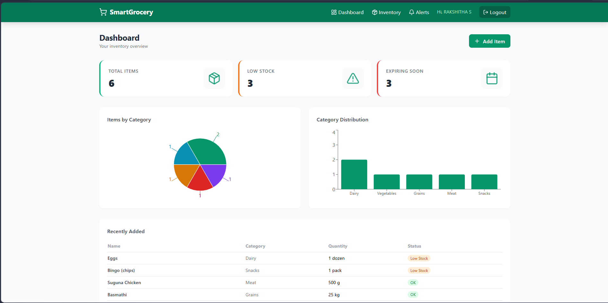

# 🛒 Smart Grocery List & Inventory Manager

A full-stack MERN web application to manage your grocery inventory with real-time stock tracking, low-stock alerts, expiry date warnings, and a comprehensive dashboard.



## 🚀 Live Demo
- Frontend: [vercel-link]
- Backend: [render-link]

## 📌 Problem Statement
Households, hostels, and small businesses often lose track of inventory — running out of essentials or wasting food due to expiry. This app solves that with a smart digital inventory system.

## ✨ Features
- 🔐 JWT Authentication (Register/Login)
- ➕ Add, Edit, Delete grocery items
- 📦 Track quantity with +/- buttons
- 🔍 Search and filter by category
- ⚠️ Low-stock alerts (when qty < min stock)
- 📅 Expiry date tracking (alerts within 7 days)
- 🛍️ Auto-generated shopping list from low-stock items
- 📊 Dashboard with Recharts pie & bar charts
- 📱 Responsive design with Tailwind CSS

## 🛠️ Tech Stack
| Layer | Technology |
|-------|-----------|
| Frontend | React 18 (Vite), Tailwind CSS, Recharts |
| Backend | Node.js, Express.js |
| Database | MongoDB Atlas, Mongoose |
| Auth | JWT, bcrypt.js |
| HTTP Client | Axios |
| Icons | Lucide React |

## 📁 Folder Structure
Smart-Grocery-Inventory-Manager/
├── client/          # React frontend
└── server/          # Express backend
## ⚙️ Installation & Setup

### Prerequisites
- Node.js v18+
- MongoDB Atlas account

### Backend Setup
```bash
cd server
npm install
cp .env.example .env
# Fill in MONGO_URI and JWT_SECRET in .env
npm run dev
```

### Frontend Setup
```bash
cd client
npm install
echo "VITE_API_URL=http://localhost:5000/api" > .env
npm run dev
```

## 📡 API Endpoints

| Method | Endpoint | Description | Auth |
|--------|----------|-------------|------|
| POST | /api/auth/register | Register user | ❌ |
| POST | /api/auth/login | Login user | ❌ |
| GET | /api/items | Get all items | ✅ |
| POST | /api/items | Add item | ✅ |
| PUT | /api/items/:id | Update item | ✅ |
| DELETE | /api/items/:id | Delete item | ✅ |
| PATCH | /api/items/:id/quantity | Update quantity | ✅ |
| GET | /api/items/alerts/lowstock | Low-stock items | ✅ |
| GET | /api/items/alerts/expiry | Expiry alerts | ✅ |
| GET | /api/dashboard | Dashboard data | ✅ |

## 📸 Screenshots

| Page | Preview |
|------|---------|
| Dashboard |  |
| Inventory |  |
| Alerts |  |

## 🎓 Learning Outcomes
- MERN stack full-stack development
- JWT authentication flow
- RESTful API design
- MongoDB schema design and aggregation
- React Context API for state management
- Tailwind CSS responsive design
- Recharts data visualization
- Git workflow and GitHub documentation

## 👨‍💻 Author
Seethaka Rakshitha — [GitHub](https://github.com/Seethaka-R) | [LinkedIn](https://www.linkedin.com/in/seethaka-rakshitha/)

## 📄 License
MIT